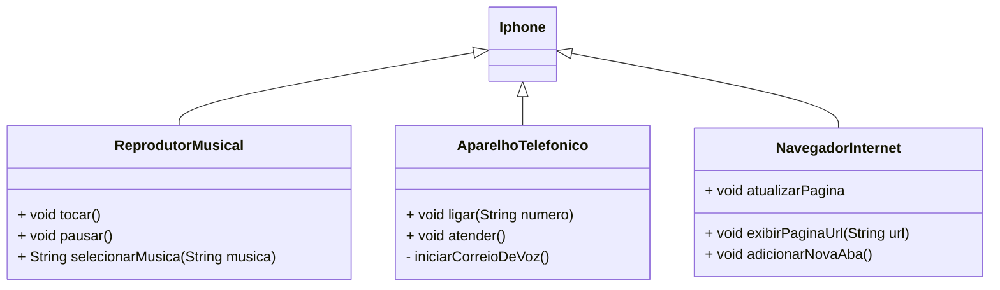

# POO - Projeto Desafio
### Moelagem UML Primeiro Iphone e suas funcionalidades

## Implementação simples em Java

A implementação simples feita somente para demonstrar a estruturação das classes e dos seus métodos de funções.